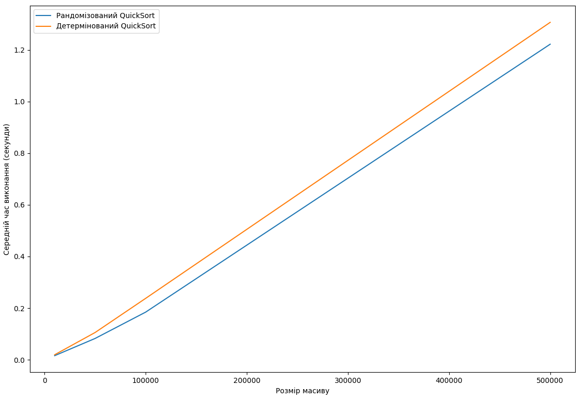

# goit-algo2-hw-10

## Task 1

### Description

Реалізуйте рандомізований та детермінований
алгоритми сортування QuickSort.
Проведіть порівняльний аналіз їхньої ефективності,
 вимірявши середній час виконання на масивах різного розміру.

### Result

Як і очікувалось рандомізований QuickSort працює швидше за детермінований, оскільки він обирає опорний елемент випадковим чином, що в свою чергу зменшує кількість випадків, коли відбувається найгірший випадок
### Output
```
Розмір масиву: 10000
        Рандомізований QuickSort: 0.0159 секунд
        Детермінований QuickSort: 0.0194 секунд
Розмір масиву: 50000
        Рандомізований QuickSort: 0.0825 секунд
        Детермінований QuickSort: 0.1055 секунд
Розмір масиву: 100000
        Рандомізований QuickSort: 0.1845 секунд
        Детермінований QuickSort: 0.2378 секунд
Розмір масиву: 500000
        Рандомізований QuickSort: 1.2219 секунд
        Детермінований QuickSort: 1.3066 секунд
```
### Graph
Візуалізація результатів:



### Task 2

### Description

Реалізуйте функцію **create_schedule(subjects, teachers)**, яка створює розклад занять для викладачів на основі наданих предметів та викладачів.


### Realization

Функція **create_schedule(subjects, teachers)** створює розклад занять для викладачів на основі наданих предметів та викладачів. 
Спочатку перевіряємо чи всі предмети можна покрити наявними викладачами, якщо ні, то повертаємо None.

Далі ітеруємо по предметам, знаходимо найкращого викладача, який може викладати предмет, 
для знаходження найкращого викладача використовуємо функцію **get_best_teacher**,
```python
def get_best_teacher(teachers, subjects):
    """Get best teacher."""
    return max(
        teachers,
        key=lambda teacher: (len(teacher.can_teach_subjects & subjects), teacher.age),
    )
```
яка обирає викладача з найбільшою кількістю предметів, які може викладати із урахуванням віку викладача та поточних не покритих предметів.

```python
def create_schedule(subjects, teachers):
    """Create schedule."""
    schedule = []
    unassigned_subjects = subjects.copy()
    all_teachers_subjects = [teacher.can_teach_subjects for teacher in teachers]
    if not subjects.issubset(set.union(*all_teachers_subjects)):
        return None
    while unassigned_subjects:
        best_teacher = get_best_teacher(teachers, unassigned_subjects)
        subjects = best_teacher.can_teach_subjects & unassigned_subjects
        best_teacher.assign_subject(subjects)
        schedule.append(best_teacher)
```

### Result

```
Розклад занять:
Микола Коваленко, 51 років, email: m.kovalenko@example.com
        Викладає предмети: Математика, Інформатика

Наталія Шевченко, 29 років, email: n.shevchenko@example.com
        Викладає предмети: Хімія, Біологія

Олександр Іваненко, 45 років, email: o.ivanenko@example.com
        Викладає предмети: Фізика

```